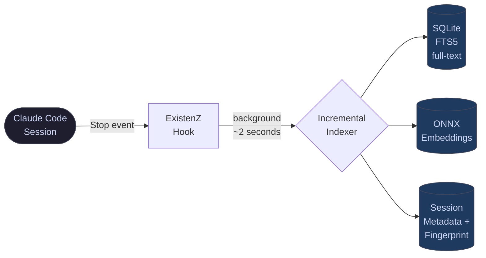
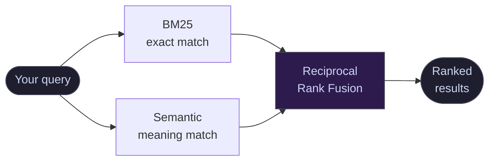

<div align="center">

# ExistenZ

### Claude Code doesn't remember. ExistenZ does.

[](https://www.python.org/)
[](LICENSE)
[](tests/)
[](#)
[](#)

<br>

**Every decision you made. Every insight you reached. Every conversation you had.**<br>
All of it — searchable, reconstructable, permanent.

</div>

---

## 🧩 The problem

Claude Code is stateless — every session starts fresh. This is one of the most discussed frustrations in the community, and it affects every kind of work:

- 🔁 You **re-explain** context you've already explained
- 🔍 You **re-discover** things you already figured out
- ❌ You **lose** decisions, guidelines, findings the moment the session ends

The knowledge lives in session files on your disk. But there's no way to get back to it.

> After 100 sessions, this is annoying. After 500 sessions, it's a serious productivity problem.

The existing tools help at the margins — basic keyword search, or semantic search, each on its own. No hybrid approach. No session fingerprinting. No continuation mode. No reconstruction.

**ExistenZ is the version that actually solves it.**

---

## ⚡ How it works

ExistenZ hooks into Claude Code's `Stop` event. After every single response, it automatically indexes the session in the background — incrementally, in under two seconds, without interrupting anything.

The result is a fully searchable archive of your entire history:

| Engine | What it does |
|---|---|
| **BM25** (SQLite FTS5) | Exact word matching — fast and precise |
| **Semantic** (ONNX, local) | Meaning matching — finds results even when the words differ |
| **Reciprocal Rank Fusion** | Combines both lists into one ranking that beats either alone |

---

## 👥 Who it's for

Not just developers. Anyone doing complex, ongoing work with Claude Code.

| 💻 Development | Architecture decisions, bug fixes, code patterns, deploy history |
|---|---|
| ✍️ Content & writing | Tone guidelines, approved drafts, client feedback, style decisions |
| 📈 SEO & marketing | Keyword strategies, competitor analyses, campaign decisions |
| 🔬 Research & analysis | Findings, source lists, conclusions, methodology decisions |
| 🎯 Strategy & consulting | Client briefs, recommendations, decisions, open questions |
| 📁 Any project work | What was discussed, what was delivered, what's still open |

---

## 🖥️ What it looks like

```
$ existenz "what tone did we agree on for the newsletter" --hybrid

  ExistenZ  ·  HYBRID (BM25 + Semantic)  ·  0.24s

  [1] 2026-03-18  client-project  7f2b1c9a
      "agreed: direct, no corporate language, max 3 paragraphs per section,
       always end with one concrete next step — no vague CTAs"
      → read-session 7f2b1c9a --last 5

  [2] 2026-03-04  content-strategy  4d8e3f11
      "client rejected formal tone in v2 — wants conversational, first person,
       short sentences. Reference: the onboarding email they sent us."
      → read-session 4d8e3f11 --context
```

The session IDs lead directly to the full conversation. `read-session <id> --last 5` gives you the exact last five message pairs — word for word — ready to paste as context into a new session.

---

## 📖 Use cases

<br>

### 🔄 Pick up where you left off

**The situation:** You were deep in a project yesterday. Today you open a new session — and Claude Code knows nothing.

**What you do:** `existenz --continuation "project-name"`

**What you get:**
- 📅 The most recent sessions, with timestamps and topic tags
- 💬 The exact last message from each session
- 🔗 Direct pointers to reconstruct full context

You call `read-session` on the relevant session, paste the context into the new one — and you're back in 10 seconds instead of 10 minutes.

---

### 🔎 Recover a decision

**The situation:** Something comes up that you know you've worked through — a client preference, a pricing decision, a guideline, a technical tradeoff. You don't remember the words, just the conclusion.

**What you do:** `existenz "what we decided about X" --hybrid`

**What you get:**
- 📌 The session where the decision was made
- 💡 The reasoning and context behind it
- 🗓️ When it happened and which project it belongs to

The semantic engine finds it even when you don't remember the exact phrasing.

---

### 📋 Reconstruct a client brief

**The situation:** You're starting a new deliverable for a client and want to go back to the original briefing — target audience, tone, constraints, what was ruled out.

**What you do:** `existenz "briefing target audience brand voice" --semantic`

**What you get:**
- 🎯 The original requirements and constraints
- 🗣️ Tone and style guidelines that were agreed
- ⚠️ What the client explicitly rejected in earlier rounds

---

### ✅ See everything that's been completed

**The situation:** You need a full picture of what's been finished — for a client report, a retrospective, or just to know where things stand.

**What you do:** `existenz --milestone --since 2026-01-01`

**What you get:**
- 🏁 A chronological list of completed sessions — deliveries approved, content published, features shipped
- 📊 Filterable by project, date range, or topic
- 🔗 Direct links to read the full context of each completion

---

### 🗺️ Re-onboard after a break

**The situation:** Coming back after two weeks away from a project. You need the full picture before touching anything.

**What you do:** `existenz --briefing "project-name"`

**What you get:**
- 📈 Session count, total turns, last active date
- ✓ Completed milestones with dates
- ✗ In-progress items that were never finished
- 🧵 Open threads with direct pointers to resume them

---

### 💬 Pull a specific fact or quote

**The situation:** You remember Claude gave you a specific benchmark, source reference, or recommendation weeks ago — and you need it right now.

**What you do:** `existenz "conversion rate benchmark ecommerce" --hybrid`

**What you get:**
- 📎 The exact excerpt from the original session
- 🗂️ Which project and when it was discussed
- 🔁 The option to read the full context around it

No re-researching what you've already researched. Exact result in under a second.

---

### 🛠️ Find the fix (for developers)

**The situation:** A problem that looks familiar. You're sure you've solved something like this before — different project, three months ago.

**What you do:** `existenz "CORS 403 on POST requests" --hybrid`

**What you get:**
- 🐛 The diagnosis from the previous session
- ✅ The exact fix that worked
- 📁 The full session context if you need to go deeper

The fix that took two hours the first time takes two minutes the second.

---

## 🏗️ Architecture

### Indexing — runs silently after every response



### Search — two engines, one result



### Reconstruction — three modes

Once you have a session ID, `read-session` reconstructs the conversation:

| Mode | What you get |
|---|---|
| `--last 5` | Last N message pairs, exact wording — paste directly as context |
| `--context` | Smart summary (~5–8k tokens) optimized for resuming in a new session |
| `--full` | Complete session, untruncated |

---

## ✨ Features at a glance

| | |
|---|---|
| 🔀 **Hybrid search** | BM25 + Semantic via Reciprocal Rank Fusion — finds what you searched *and* what you meant |
| 🏷️ **Session fingerprinting** | Every session auto-tagged: deploy, milestone, or topic cluster |
| ▶️ **Continuation mode** | One command to see where you left off across any project |
| 📄 **Project briefing** | Full re-onboarding: completed, in-progress, open threads |
| 🔁 **Reconstruction** | Read back any session in the mode you need |
| 🌍 **Multilingual** | German/English mixed content, umlauts normalized, CamelCase split |
| 🔒 **100% offline** | ONNX embeddings run locally — nothing ever leaves your machine |
| ⚙️ **Zero-maintenance** | Stop Hook indexes every response automatically — nothing to do |

---

## 🆚 vs. Alternatives

| | ExistenZ | [search-sessions](https://github.com/sinzin91/search-sessions) | [cc-conversation-search](https://github.com/akatz-ai/cc-conversation-search) |
|---|:---:|:---:|:---:|
| Hybrid BM25 + Semantic | ✅ | ❌ | ✅ |
| Session fingerprinting | ✅ | ❌ | ❌ |
| Continuation / briefing mode | ✅ | ❌ | ❌ |
| Conversation reconstruction | ✅ | ❌ | ❌ |
| Multilingual | ✅ | ❌ | ❌ |
| Auto-index via hook | ✅ | manual | manual |
| Fully offline | ✅ | ✅ | ✅ |

---

## 🚀 Installation

**Requirements:** Python 3.10+ · [Claude Code](https://claude.ai/code) installed · macOS or Linux

```bash
git clone https://github.com/456253475624576457/existenz
cd existenz
bash install.sh
```

The installer handles everything in one step:

- 📦 Installs `fastembed` + `numpy` (via `uv` or `pip`)
- 📁 Places `existenz` in `~/.claude/scripts/`
- 🔗 Places `read-session` in `/usr/local/bin/`
- ⚙️ Wires the Stop Hook into `~/.claude/settings.json`
- 🗂️ Builds the initial index (downloads ~33MB model on first run)

```bash
# Add to PATH if needed
echo 'export PATH="$HOME/.claude/scripts:$PATH"' >> ~/.zshrc && source ~/.zshrc

# Upgrade or remove
bash install.sh --upgrade
bash install.sh --uninstall
```

---

## 📚 All commands

```bash
# Search
existenz "query"                        # Exact match (BM25)
existenz "query" --hybrid               # Exact + semantic — best quality
existenz "query" --semantic             # Semantic — finds related concepts
existenz "term1 term2" --any            # OR logic
existenz "query" --since 2026-01-01    # Filter by date
existenz "query" --deployed             # Only sessions with a deploy
existenz "query" --milestone            # Only completed milestones
existenz "query" --unique               # One result per session
existenz "query" --project "name"       # Limit to one project

# Resume
existenz --continuation "project"       # Where was I in the last 48h?
existenz --briefing "project"           # Full project re-onboarding

# Reconstruct
read-session <id> --last 5              # Last N message pairs, exact wording
read-session <id> --context             # Smart summary, optimized to resume
read-session <id> --full                # Complete session, untruncated

# Index
existenz --index                        # Incremental update (auto via hook)
existenz --index --force                # Full rebuild
existenz --stats                        # Statistics
existenz --fingerprint-all              # Classify all sessions
```

---

## ⚙️ Configuration

### Environment variables

| Variable | Default | Description |
|---|---|---|
| `EXISTENZ_DATA_DIR` | `~/.claude` | Base directory for index files |
| `EXISTENZ_SESSIONS_DIR` | `~/.claude/projects` | Claude Code session storage |
| `EXISTENZ_INDEX_DB` | `~/.claude/session-index.db` | SQLite full-text index |
| `EXISTENZ_EMBED_MODEL` | `BAAI/bge-small-en-v1.5` | Embedding model |

> Legacy `SSS_*` variables still accepted for backwards compatibility.

### Embedding models

| Model | Size | Best for |
|---|---|---|
| `BAAI/bge-small-en-v1.5` | 33 MB | English sessions (default) |
| `intfloat/multilingual-e5-small` | 117 MB | **Mixed-language sessions — recommended** |
| `BAAI/bge-m3` | 568 MB | Maximum multilingual quality |

```bash
EXISTENZ_EMBED_MODEL=intfloat/multilingual-e5-small existenz --index --force
```

> Index size: ~0.4 MB per session (~285 MB at 500 sessions). See [PRIVACY.md](PRIVACY.md).

---

## 🔒 Privacy

All data stays on your machine. Your session index contains your full conversation history — treat it like sensitive data: never commit it, never share it.

See [PRIVACY.md](PRIVACY.md) — what the index contains, how to move it to an encrypted volume, and how to delete it cleanly.

---

## 👤 Built by

**Florian Stangl** — built out of necessity after 500+ Claude Code sessions across development, SEO, content strategy, and client work. The session history was always there. Getting back to it wasn't.

---

## 📄 License

MIT — see [LICENSE](LICENSE).
