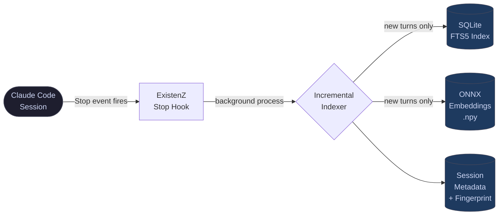
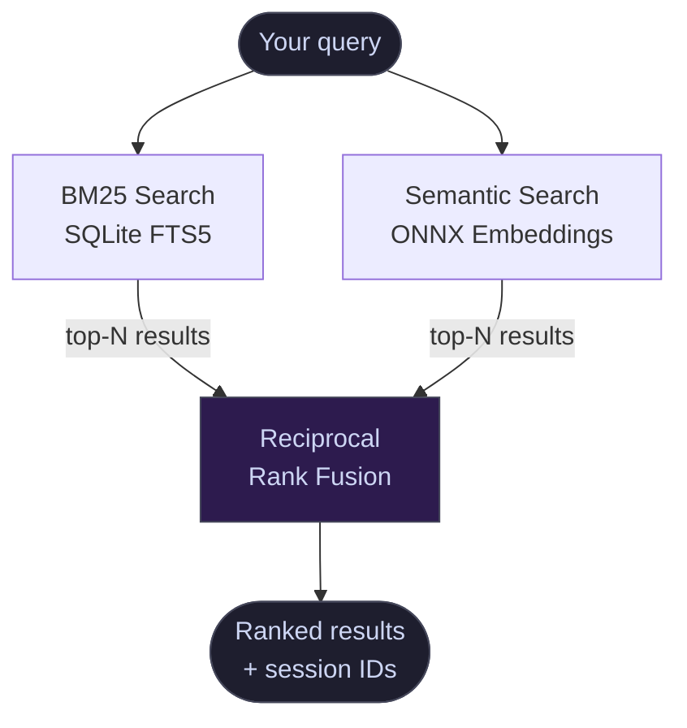
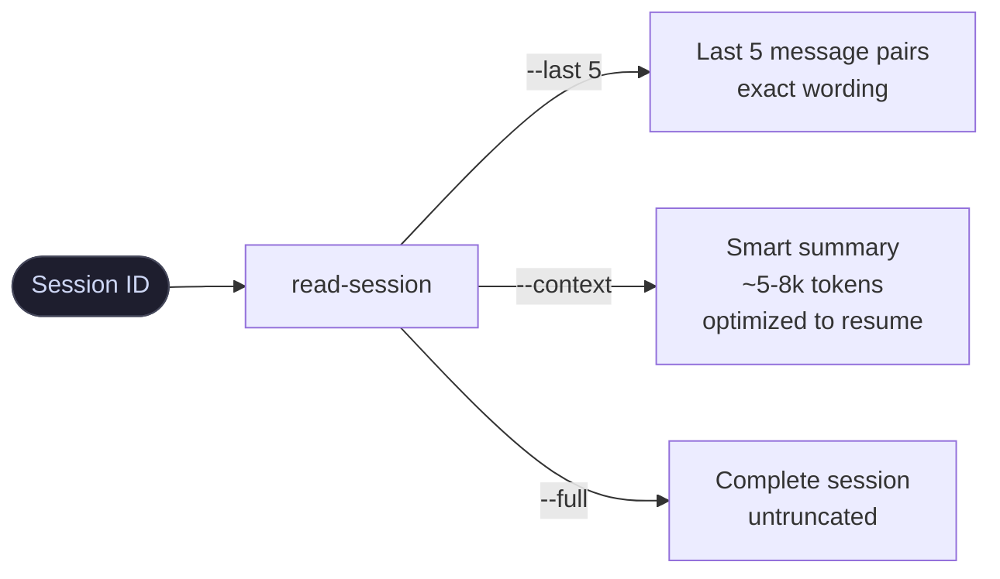

<div align="center">

# ExistenZ

### Claude Code doesn't remember. ExistenZ does.

[](https://www.python.org/)
[](LICENSE)
[](tests/)
[](#)
[](#)

Every decision you made. Every bug you fixed. Every conversation you had.<br>
All of it — **searchable, reconstructable, permanent.**

</div>

---

## The problem nobody talks about

You use Claude Code every day. Each session, you build context — architecture decisions, discovered gotchas, hard-won fixes. Then the session ends.

Next time you start fresh. You re-explain. You re-discover. You re-fix.

After 100 sessions: a graveyard of lost knowledge.
After 500 sessions: thousands of hours that simply don't exist anymore.

**ExistenZ makes them exist.**

---

## How it looks in practice

```
$ existenz "why did the database migrations keep failing" --hybrid

━━━━━━━━━━━━━━━━━━━━━━━━━━━━━━━━━━━━━━━━━━━━━━━━━━━
  ExistenZ  ·  HYBRID (BM25 + Semantic)  ·  0.28s
━━━━━━━━━━━━━━━━━━━━━━━━━━━━━━━━━━━━━━━━━━━━━━━━━━━

  [1] 2026-03-21  backend / 4a8f2c1b
      "migrations failed silently — alembic env.py was not picking up
       DATABASE_URL from .env, only from shell environment"
      → read-session 4a8f2c1b --last 5

  [2] 2026-03-14  infra-setup / d91b3e7a
      "postgres container restarted mid-migration — added health check
       and retry logic to docker-compose.yml"
      → read-session d91b3e7a --context

  [3] 2026-02-28  devops / c55f0812
      "foreign key constraints not deferred — had to wrap migration in
       SET CONSTRAINTS ALL DEFERRED transaction"
      → read-session c55f0812 --last 3
```

```
$ read-session 4a8f2c1b --last 5

[2026-03-21 14:32] USER
  The migrations are failing again, same as last week

[2026-03-21 14:32] ASSISTANT
  Looking at the alembic logs — the issue is DATABASE_URL. Your env.py
  reads os.environ.get("DATABASE_URL") but python-dotenv isn't loaded
  at that point. Fix: add load_dotenv() at the top of env.py before
  the config block.

[2026-03-21 14:35] USER
  That fixed it. Also the test suite is still red.

[2026-03-21 14:35] ASSISTANT
  The test DB uses a separate DATABASE_TEST_URL — it's not set in CI...
```

---

## Architecture

### Indexing flow — runs after every response



### Search flow — hybrid retrieval



### Session reconstruction



---

## Real-world use cases

### 1 — Resume work the next morning

You were deep in a refactor yesterday. Today you open a new session with zero context.

```bash
$ existenz --continuation "auth-service"

━━━━━━━━━━━━━━━━━━━━━━━━━━━━━━━━━━━━━━━━━━
  CONTINUATION — last 48h — "auth-service"
━━━━━━━━━━━━━━━━━━━━━━━━━━━━━━━━━━━━━━━━━━

  Yesterday (2026-03-26, 14:31–17:44, ~42 turns)
  Session: 7f3a9b2c
  Topics:  jwt · refresh-token · redis · middleware
  Status:  🔨 in progress — no milestone detected

  Last message:
  "The refresh token rotation is working but we haven't handled
   the concurrent request race condition yet — next step is Redis
   SETNX for token locking"

  → read-session 7f3a9b2c --context     (resume with full context)
  → read-session 7f3a9b2c --last 5      (see exact last messages)
```

Then paste the context into your new session. You're back in 10 seconds.

---

### 2 — Rediscover a fix from months ago

A bug that looks familiar. You're sure you've seen this before.

```bash
$ existenz "CORS preflight 403 only on POST requests" --hybrid

  [1] 2026-01-12  api-gateway / b3c1d9f0
      "nginx was stripping Authorization header on preflight — fixed with
       proxy_pass_header + explicit OPTIONS handling in location block"
      → read-session b3c1d9f0 --last 5
```

Exact fix, exact context, 0.3 seconds.

---

### 3 — Reconstruct an architectural decision

You're onboarding a teammate and need to explain why you chose approach X over Y.

```bash
$ existenz "why did we pick postgres over mongodb" --semantic

  [1] 2025-12-03  architecture-review / 1a2b3c4d
      "strong consistency required for financial transactions — eventual
       consistency was a dealbreaker. Also existing team has SQL expertise."
      → read-session 1a2b3c4d --context
```

The decision, the reasoning, the tradeoffs — all still there.

---

### 4 — Find all production deploys

Something broke in production. When did we last deploy, and what changed?

```bash
$ existenz "production deploy" --deployed --since 2026-03-01

  [1] 2026-03-26  checkout-service  🚀 deployed
  [2] 2026-03-22  user-api          🚀 deployed
  [3] 2026-03-18  frontend          🚀 deployed
```

---

### 5 — Full project re-onboarding after a break

Coming back after two weeks off. Need everything — current state, open threads, key decisions.

```bash
$ existenz --briefing "my-project"

━━━━━━━━━━━━━━━━━━━━━━━━━━━━━━━━━━━━━━━
  PROJECT BRIEFING — "my-project"
━━━━━━━━━━━━━━━━━━━━━━━━━━━━━━━━━━━━━━━

  38 sessions · 1,240 turns · last active: 2026-03-12

  Recent milestones:
  ✓ 2026-03-10  checkout flow v2 shipped
  ✓ 2026-03-05  payment provider migrated
  ✗ 2026-03-12  email notifications — in progress, no completion

  Top open threads:
  → read-session a1b2c3d4 --context   (email notifications)
  → read-session e5f6a7b8 --context   (performance regression)
```

---

## Features

| | |
|---|---|
| **Hybrid search** | BM25 (exact) + Semantic (meaning) fused via Reciprocal Rank Fusion — the best of both |
| **Session fingerprinting** | Every session auto-classified: deploy / milestone / topic clusters |
| **Continuation mode** | One command to pick up exactly where you left off |
| **Full reconstruction** | Read back any session — last N messages, smart summary, or complete |
| **Multilingual** | German/English mixed content, umlauts normalized, CamelCase split |
| **100% offline** | ONNX embeddings run locally, no API calls, nothing leaves your machine |
| **Auto-indexed** | Stop Hook indexes every response in the background — zero manual work |
| **Incremental** | Only new turns get indexed — runs in under 2 seconds |

---

## vs. Alternatives

| Feature | ExistenZ | [search-sessions](https://github.com/sinzin91/search-sessions) | [cc-conversation-search](https://github.com/akatz-ai/cc-conversation-search) |
|---------|:--------:|:--------------:|:--------------------:|
| Hybrid BM25 + Semantic | ✅ | ❌ | ✅ |
| Session fingerprinting | ✅ | ❌ | ❌ |
| Continuation / briefing mode | ✅ | ❌ | ❌ |
| Full conversation reconstruction | ✅ | ❌ | ❌ |
| Multilingual | ✅ | ❌ | ❌ |
| Auto-index via Stop Hook | ✅ | manual | manual |
| Offline / no API | ✅ | ✅ | ✅ |

---

## Requirements

- Python 3.10+
- [Claude Code](https://claude.ai/code) installed (`~/.claude/` must exist)
- macOS or Linux

---

## Installation

```bash
git clone https://github.com/456253475624576457/existenz
cd existenz
bash install.sh
```

The installer handles everything:

```
[existenz] Python 3.12 found.
[existenz] Installing Python dependencies...
[existenz] Installing existenz to ~/.claude/scripts/existenz...
[existenz] Installing read-session to /usr/local/bin/read-session...
[existenz] Wiring Stop Hook in ~/.claude/settings.json...
           Stop Hook added: ~/.claude/scripts/existenz --index
[existenz] Building initial search index...
           → Downloading BAAI/bge-small-en-v1.5 (33MB, one-time)
           → Indexed 247 sessions / 18,432 turns
[existenz] Installation complete!
```

**Add to PATH if needed:**
```bash
echo 'export PATH="$HOME/.claude/scripts:$PATH"' >> ~/.zshrc && source ~/.zshrc
```

**Upgrade:** `bash install.sh --upgrade`
**Remove:** `bash install.sh --uninstall`

---

## All commands

```bash
# ── Search ─────────────────────────────────────────────────────────────────
existenz "query"                       # BM25 — fast, exact match
existenz "query" --hybrid              # Best quality: BM25 + Semantic
existenz "query" --semantic            # Semantic only — finds related concepts
existenz "term1 term2 term3" --any     # OR logic — any term matches
existenz "query" --since 2026-01-01   # Filter by date
existenz "query" --deployed            # Only sessions with a deploy
existenz "query" --milestone           # Only sessions with a completed milestone
existenz "query" --unique              # One best result per session
existenz "query" --role user           # Search only your messages
existenz "query" --project "name"      # Limit to one project

# ── Resume ─────────────────────────────────────────────────────────────────
existenz --continuation "project"      # Where was I in the last 48h?
existenz --briefing "project"          # Full project re-onboarding

# ── Reconstruct ────────────────────────────────────────────────────────────
read-session <id> --last 5             # Last 5 message pairs — exact wording
read-session <id> --context            # Smart summary, optimized to resume
read-session <id> --full               # Everything, untruncated
read-session <id> --summary            # Only auto-summaries Claude generated

# ── Index ──────────────────────────────────────────────────────────────────
existenz --index                       # Incremental update (auto-runs via hook)
existenz --index --force               # Full rebuild from scratch
existenz --stats                       # Index statistics
existenz --fingerprint-all             # Classify all sessions (idempotent)
```

---

## Configuration

### Environment variables

| Variable | Default | Description |
|----------|---------|-------------|
| `EXISTENZ_DATA_DIR` | `~/.claude` | Base directory for all index files |
| `EXISTENZ_SESSIONS_DIR` | `~/.claude/projects` | Claude Code session files |
| `EXISTENZ_INDEX_DB` | `~/.claude/session-index.db` | SQLite full-text index |
| `EXISTENZ_EMBED_MODEL` | `BAAI/bge-small-en-v1.5` | Embedding model (see below) |

> Legacy `SSS_*` variables are still accepted for backwards compatibility.

### Embedding models

| Model | Size | Languages | When to use |
|-------|------|-----------|-------------|
| `BAAI/bge-small-en-v1.5` | 33 MB | English | Default — fast, good for English sessions |
| `intfloat/multilingual-e5-small` | 117 MB | 100+ | **Recommended** if you mix languages |
| `BAAI/bge-m3` | 568 MB | 100+ | Maximum quality, larger footprint |

Switch model (one-time, rebuilds embeddings):
```bash
EXISTENZ_EMBED_MODEL=intfloat/multilingual-e5-small existenz --index --force
```

### Index size

| Sessions | Approx. total |
|----------|---------------|
| 100 | ~55 MB |
| 500 | ~285 MB |
| 1,000 | ~570 MB |

~0.4 MB per session. No automatic pruning. See [PRIVACY.md](PRIVACY.md) for managing index size.

---

## Privacy

All data stays on your machine. Your sessions contain your full conversation history — treat the index like source code: never commit it, never share it.

See [PRIVACY.md](PRIVACY.md) for the full guide — what the index contains, how to move it to an encrypted volume, and how to delete it cleanly.

---

## Built by

Florian Stangl — built and battle-tested across 500+ Claude Code sessions.

---

## License

MIT — see [LICENSE](LICENSE).
