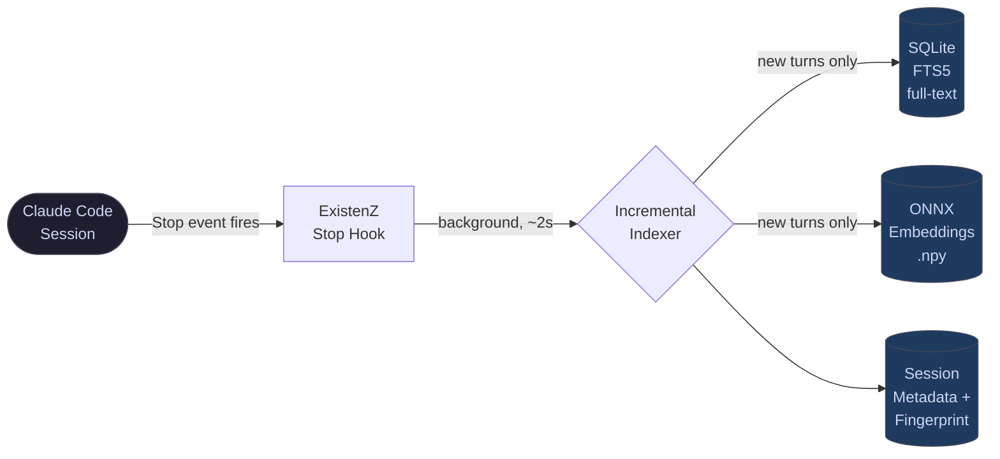
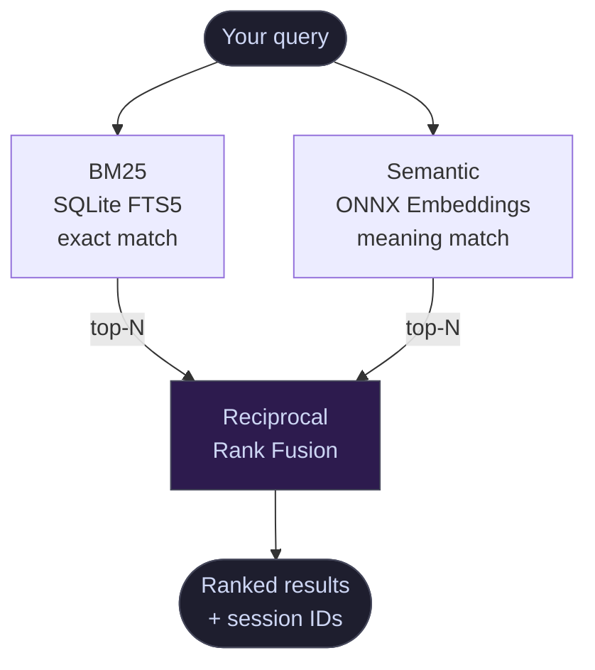
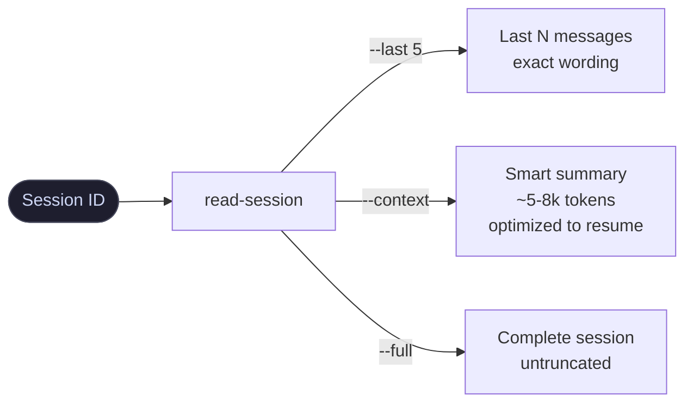

<div align="center">

# ExistenZ

### Claude Code doesn't remember. ExistenZ does.

[](https://www.python.org/)
[](LICENSE)
[](tests/)
[](#)
[](#)

Every decision you made. Every insight you reached. Every conversation you had.<br>
All of it — **searchable, reconstructable, permanent.**

</div>

---

## The problem everyone knows — and nobody has solved well

Claude Code is stateless. Every session starts fresh.

This is one of the most commonly raised frustrations in the Claude Code community — and across every kind of work. Not just code. Writing. Research. Strategy. Client work. SEO. Analysis. Any complex, ongoing work where context matters.

You build knowledge over hundreds of sessions. You make decisions, reach conclusions, develop approaches. Then the session ends. The next time you open Claude Code, everything is gone. The knowledge lives in JSONL files on your disk — but you have no way to get back to it.

**The result:** You re-explain context you've explained before. You re-discover things you already knew. You lose the thread of work that spanned multiple sessions.

The existing tools give you keyword search or semantic search — not both. No session fingerprinting. No continuation mode. No reconstruction. Just grep on a different surface.

**ExistenZ is the version that actually solves it.**

---

## Who uses ExistenZ

ExistenZ is for anyone who uses Claude Code for ongoing, complex work — regardless of the domain.

| If you work with... | ExistenZ helps you... |
|---|---|
| **Code & development** | Find past fixes, reconstruct architectural decisions, resume refactors |
| **Content & writing** | Recover tone guidelines, find approved drafts, continue multi-session projects |
| **SEO & marketing** | Retrieve keyword decisions, find competitor analyses, track what's been published |
| **Research & analysis** | Reconstruct findings, recover source lists, continue multi-week research |
| **Strategy & business** | Find past decisions, recover client briefs, track what was agreed |
| **Any project with clients** | Know what was discussed, what was delivered, what's still open |

---

## How it looks in practice

```
$ existenz "what tone and structure did we agree on for the newsletter" --hybrid

━━━━━━━━━━━━━━━━━━━━━━━━━━━━━━━━━━━━━━━━━━━━━━━━━━━
  ExistenZ  ·  HYBRID (BM25 + Semantic)  ·  0.24s
━━━━━━━━━━━━━━━━━━━━━━━━━━━━━━━━━━━━━━━━━━━━━━━━━━━

  [1] 2026-03-18  client-acme / 7f2b1c9a
      "agreed: direct, no corporate language, max 3 paragraphs per section,
       always end with one concrete next step — no vague CTAs"
      → read-session 7f2b1c9a --last 5

  [2] 2026-03-04  content-strategy / 4d8e3f11
      "client rejected formal tone in v2 — wants conversational, first person,
       short sentences. Reference: the onboarding email they sent us."
      → read-session 4d8e3f11 --context
```

```
$ read-session 7f2b1c9a --last 5

[2026-03-18 11:14] YOU
  The client came back on the draft. They want it shorter and less formal.

[2026-03-18 11:14] CLAUDE
  Based on their feedback: cut the intro paragraph entirely, replace bullet
  lists with flowing sentences, and move the CTA to the second paragraph.
  Their reference email uses "you" not "the reader" — match that throughout.

[2026-03-18 11:19] YOU
  That worked. They approved the revised version.

[2026-03-18 11:19] CLAUDE
  Good. For future drafts: direct address, max 180 words per section,
  CTA always in paragraph 2. I'll apply this as the default for this client.
```

Exact context. Exact decisions. Back in 10 seconds.

---

## Real-world use cases

### 1 — Pick up where you left off

You were deep in a complex project yesterday — research, strategy, a client brief, a piece of code. Today you open a new session with zero context.

```bash
$ existenz --continuation "client-acme"

━━━━━━━━━━━━━━━━━━━━━━━━━━━━━━━━━━━━━━━━━━━━━━
  CONTINUATION — last 48h — "client-acme"
━━━━━━━━━━━━━━━━━━━━━━━━━━━━━━━━━━━━━━━━━━━━━━

  Yesterday (2026-03-26, 15:12–18:30, ~38 turns)
  Session: 7f3a9b2c
  Topics:  newsletter · tone · approval · cta
  Status:  in progress — no milestone detected

  Last message:
  "Draft v3 is approved. Still need to finalize the subject line variants
   and schedule — that was the open item at the end of the session."

  → read-session 7f3a9b2c --context   (full context to resume)
  → read-session 7f3a9b2c --last 5    (exact last messages)
```

Paste the context into your new session. You're back in 10 seconds.

---

### 2 — Recover a decision from months ago

Something comes up that you know you've dealt with before. You know the answer exists — somewhere.

```bash
$ existenz "what did we decide about the pricing structure" --hybrid

  [1] 2026-01-09  strategy / c3d1e8f2
      "agreed: value-based pricing, not hourly — three tiers, middle tier
       positioned as default. No discounts in year one."
      → read-session c3d1e8f2 --context
```

The decision. The reasoning. The tradeoffs. All still there.

---

### 3 — Reconstruct a client brief

You're starting a new piece of work for a client. You want to go back to the original briefing conversation.

```bash
$ existenz "initial briefing target audience brand voice" --semantic

  [1] 2025-11-21  client-project / a9b7c5d3
      "target: 35-55, professional, time-poor. Brand voice: expert but
       accessible. Avoid jargon. Competitor brands: X, Y — differentiate
       by being warmer and more direct."
      → read-session a9b7c5d3 --context
```

---

### 4 — Find everything you shipped

You need a full picture of what's been completed — for a retrospective, a client report, or just to know where things stand.

```bash
$ existenz --milestone --since 2026-01-01

  ✓ 2026-03-22  homepage redesign — delivered to client
  ✓ 2026-03-14  SEO audit — report sent
  ✓ 2026-02-28  product descriptions — 47 texts live
  ✓ 2026-02-11  competitor analysis — approved
  ✓ 2026-01-30  content strategy — v2 signed off
```

---

### 5 — Re-onboard after a break

Coming back after two weeks off a project. You need the full picture — current state, open threads, key decisions — before touching anything.

```bash
$ existenz --briefing "my-project"

━━━━━━━━━━━━━━━━━━━━━━━━━━━━━━━━━━━━━━━
  PROJECT BRIEFING — "my-project"
━━━━━━━━━━━━━━━━━━━━━━━━━━━━━━━━━━━━━━━

  44 sessions · 1,580 turns · last active: 2026-03-12

  Completed:
  ✓ 2026-03-10  landing page v2
  ✓ 2026-03-05  email sequence — 5 messages

  In progress:
  ✗ 2026-03-12  product page rewrite — open, no completion

  Open threads:
  → read-session a1b2c3d4 --context   (product page)
  → read-session e5f6a7b8 --context   (SEO meta texts)
```

---

### 6 — Pull a specific quote or fact

You remember Claude gave you a specific number, source, or recommendation weeks ago — and you need it now.

```bash
$ existenz "conversion rate benchmark ecommerce" --hybrid

  [1] 2026-02-14  research / d4e5f6a7
      "industry benchmark: 1.5–3% for general ecommerce, 3–5% for niche.
       Source discussed: Baymard Institute 2025 report."
      → read-session d4e5f6a7 --last 5
```

---

### 7 — For developers: rediscover a fix

A problem that looks familiar. You know you've solved this before.

```bash
$ existenz "CORS 403 only on POST requests" --hybrid

  [1] 2026-01-12  api-gateway / b3c1d9f0
      "nginx was stripping Authorization header on preflight — fixed with
       proxy_pass_header + explicit OPTIONS handling in location block"
      → read-session b3c1d9f0 --last 5
```

---

## Architecture

### Indexing — runs silently after every response



### Search — two engines, one ranking



### Reconstruction — three modes



**BM25** finds what you search for literally — fast and precise.
**Semantic** finds what you *mean* — even if you don't remember the exact words.
**Reciprocal Rank Fusion** combines both lists into one ranking that beats either alone.

---

## Features

| Feature | What it means |
|---|---|
| **Hybrid search** | BM25 (exact) + Semantic (meaning) via Reciprocal Rank Fusion |
| **Session fingerprinting** | Every session auto-classified: deploy / milestone / topic |
| **Continuation mode** | One command to resume exactly where you left off |
| **Full reconstruction** | Read back any session — last N messages, smart summary, or complete |
| **Multilingual** | German/English mixed, umlauts normalized, CamelCase split |
| **100% offline** | ONNX embeddings run locally — nothing leaves your machine |
| **Auto-indexed** | Stop Hook indexes every response in the background |
| **Incremental** | Only new turns get indexed — under 2 seconds |

---

## vs. Alternatives

| Feature | ExistenZ | [search-sessions](https://github.com/sinzin91/search-sessions) | [cc-conversation-search](https://github.com/akatz-ai/cc-conversation-search) |
|---------|:--------:|:--------------:|:--------------------:|
| Hybrid BM25 + Semantic | ✅ | ❌ | ✅ |
| Session fingerprinting | ✅ | ❌ | ❌ |
| Continuation / briefing mode | ✅ | ❌ | ❌ |
| Full conversation reconstruction | ✅ | ❌ | ❌ |
| Multilingual | ✅ | ❌ | ❌ |
| Auto-index via Stop Hook | ✅ | manual | manual |
| Offline / no API | ✅ | ✅ | ✅ |

---

## Requirements

- Python 3.10+
- [Claude Code](https://claude.ai/code) installed (`~/.claude/` must exist)
- macOS or Linux

---

## Installation

```bash
git clone https://github.com/456253475624576457/existenz
cd existenz
bash install.sh
```

The installer handles everything:

```
[existenz] Python 3.12 found.
[existenz] Installing Python dependencies...
[existenz] Installing existenz to ~/.claude/scripts/existenz...
[existenz] Installing read-session to /usr/local/bin/read-session...
[existenz] Wiring Stop Hook in ~/.claude/settings.json...
           Stop Hook added: ~/.claude/scripts/existenz --index
[existenz] Building initial search index...
           → Downloading BAAI/bge-small-en-v1.5 (33MB, one-time)
           → Indexed 247 sessions / 18,432 turns
[existenz] Installation complete!
```

**Add to PATH if needed:**
```bash
echo 'export PATH="$HOME/.claude/scripts:$PATH"' >> ~/.zshrc && source ~/.zshrc
```

**Upgrade:** `bash install.sh --upgrade` · **Remove:** `bash install.sh --uninstall`

---

## All commands

```bash
# ── Search ─────────────────────────────────────────────────────────────────
existenz "query"                       # BM25 — fast, exact match
existenz "query" --hybrid              # Best quality: BM25 + Semantic
existenz "query" --semantic            # Semantic — finds related concepts
existenz "term1 term2 term3" --any     # OR logic — any term matches
existenz "query" --since 2026-01-01   # Filter by date
existenz "query" --deployed            # Only sessions with a deploy
existenz "query" --milestone           # Only completed milestone sessions
existenz "query" --unique              # One best result per session
existenz "query" --role user           # Search only your messages
existenz "query" --project "name"      # Limit to one project

# ── Resume ─────────────────────────────────────────────────────────────────
existenz --continuation "project"      # Where was I in the last 48h?
existenz --briefing "project"          # Full project re-onboarding

# ── Reconstruct ────────────────────────────────────────────────────────────
read-session <id> --last 5             # Last N message pairs — exact wording
read-session <id> --context            # Smart summary, optimized to resume
read-session <id> --full               # Everything, untruncated
read-session <id> --summary            # Only auto-summaries Claude generated

# ── Index ──────────────────────────────────────────────────────────────────
existenz --index                       # Incremental update (auto-runs via hook)
existenz --index --force               # Full rebuild from scratch
existenz --stats                       # Index statistics
existenz --fingerprint-all             # Classify all sessions (idempotent)
```

---

## Configuration

### Environment variables

| Variable | Default | Description |
|----------|---------|-------------|
| `EXISTENZ_DATA_DIR` | `~/.claude` | Base directory for all index files |
| `EXISTENZ_SESSIONS_DIR` | `~/.claude/projects` | Claude Code session files |
| `EXISTENZ_INDEX_DB` | `~/.claude/session-index.db` | SQLite full-text index |
| `EXISTENZ_EMBED_MODEL` | `BAAI/bge-small-en-v1.5` | Embedding model |

> Legacy `SSS_*` variables still accepted for backwards compatibility.

### Embedding models

| Model | Size | Best for |
|-------|------|----------|
| `BAAI/bge-small-en-v1.5` | 33 MB | English sessions (default, fastest) |
| `intfloat/multilingual-e5-small` | 117 MB | **Mixed-language sessions — recommended** |
| `BAAI/bge-m3` | 568 MB | Maximum multilingual quality |

```bash
EXISTENZ_EMBED_MODEL=intfloat/multilingual-e5-small existenz --index --force
```

### Index size

| Sessions | Approx. size |
|----------|--------------|
| 100 | ~55 MB |
| 500 | ~285 MB |
| 1,000 | ~570 MB |

~0.4 MB per session. See [PRIVACY.md](PRIVACY.md) for managing index size.

---

## Privacy

All data stays on your machine. Your sessions contain your full conversation history — treat the index like sensitive data: never commit it, never share it.

See [PRIVACY.md](PRIVACY.md) — what the index contains, how to move it to an encrypted volume, how to delete it cleanly.

---

## Built by

Florian Stangl — built out of necessity after 500+ Claude Code sessions spanning development, SEO, content strategy, and client work. The session history was always there. Getting back to it wasn't.

---

## License

MIT — see [LICENSE](LICENSE).
